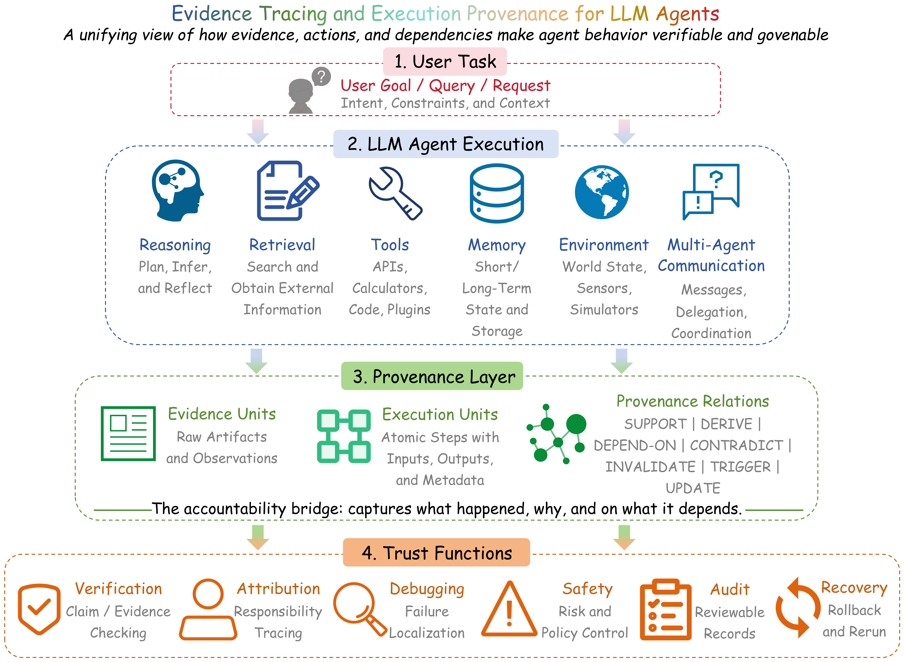
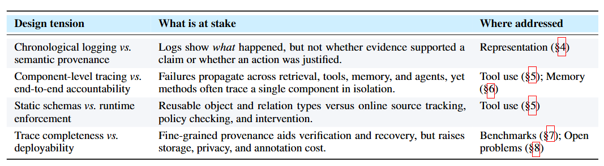
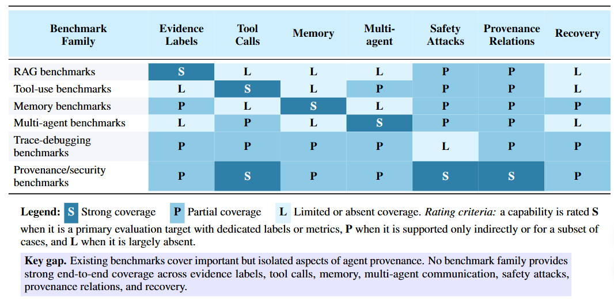

<h1 align="center">From Agent Traces to Trust</h1>

<p align="center">
  <b>A Survey of Evidence Tracing and Execution Provenance in LLM Agents</b>
</p>

<p align="center">
  <a href="Agent_Tracing_Survey.pdf"></a>
  
  
  
</p>

<p align="center">
  Yiqi Wang, Jiaqi Zhang, Taotao Cai, Zirui Liu, Qingqiang Sun, Zequn Sun,
  Zhangkai Wu, Mingkai Zheng, Yanming Zhu
</p>

> This repository hosts the survey manuscript, figures, and reading guide for
> <b>From Agent Traces to Trust: A Survey of Evidence Tracing and Execution Provenance in LLM Agents</b>.

## News

`Jun. 12, 2026` Initial release of the survey PDF and project README.

## Contents

- [Overview](#overview)
- [Why Agent Provenance?](#why-agent-provenance)
- [Core Concepts](#core-concepts)
- [Survey Contributions](#survey-contributions)
- [Survey Roadmap](#survey-roadmap)
- [Categorized References](#categorized-references)
- [Figures](#figures)
- [Open Problems](#open-problems)
- [Repository Structure](#repository-structure)
- [Citation](#citation)
- [Contact](#contact)

## Overview

Large language model (LLM) agents increasingly solve complex tasks by using
retrieval systems, external tools, memory modules, environments, and other
agents. These capabilities make agents more autonomous, but they also make
their behavior harder to verify, debug, and audit. A final answer alone cannot
explain which evidence supported each claim, whether tool calls were justified,
how memory influenced later decisions, or where an execution failure originated.

This survey studies that accountability gap through two connected ideas:

- **Execution provenance**: the full typed graph of an agent execution, including
  retrieved evidence, tool calls, tool outputs, memory reads and writes,
  observations, intermediate claims, actions, messages, and final answers.
- **Evidence tracing**: the evidence-support projection of that provenance,
  focused on how claims, decisions, and actions are supported, contradicted,
  invalidated, or influenced by evidence.

<p align="center">
  
</p>

## Why Agent Provenance?

Modern LLM agents are no longer simple text generators. They plan, retrieve,
call APIs, execute code, update memory, interact with web or GUI environments,
and coordinate with other agents. This shifts evaluation from answer-only
correctness toward process-level accountability.

This survey argues that trustworthy agents need infrastructure that can:

- connect final answers to supporting evidence;
- explain how tool calls, memory items, observations, and intermediate claims
  shaped later decisions;
- detect unsupported, contradicted, stale, poisoned, or unsafe information;
- localize failures across retrieval, reasoning, tools, memory, environments,
  and multi-agent communication;
- support audit, recovery, governance, and runtime safety.

## Core Concepts

| Concept | Meaning in this survey |
| --- | --- |
| Agent trace | The recorded sequence of information items, reasoning states, actions, observations, and outputs generated or consumed during an agent run. |
| Evidence tracing | Mechanisms that identify, record, and connect evidence units that support, contradict, invalidate, or influence agent claims, decisions, and actions. |
| Execution provenance | A structured representation of how an agent execution unfolds across retrieved documents, tool calls, parameters, observations, memory operations, inter-agent messages, and outputs. |
| Provenance graph | A graph representation whose nodes are evidence or execution units and whose edges encode relations such as `SUPPORT`, `DERIVE`, `DEPEND-ON`, `CONTRADICT`, `INVALIDATE`, and `UPDATE`. |
| Process-level accountability | The ability to verify not only what answer an agent produced, but how and why that answer or action was produced. |

## Survey Contributions

This survey makes five main contributions:

1. It identifies evidence tracing and execution provenance as a central
   accountability layer for LLM agents.
2. It introduces a five-dimensional taxonomy covering trace sources, evidence
   and execution units, provenance relations, tracing granularity and timing,
   and trust functions.
3. It maps representative agent systems onto the taxonomy and connects agent
   provenance to the W3C PROV model.
4. It reviews methods for evidence attribution, tool-use provenance, runtime
   guardrails, provenance-bearing memory, observability, and failure diagnosis.
5. It surveys benchmarks, datasets, and metrics, then outlines future directions
   for unified schemas, claim-level provenance, recovery-oriented evaluation,
   privacy-aware audit, and trustworthy agent infrastructure.

## Survey Roadmap

| Section | Focus |
| --- | --- |
| 1 | Introduction: why final-answer accuracy is insufficient for LLM agents. |
| 2 | Background on LLM agents, execution traces, and trustworthiness. |
| 3 | Taxonomy of evidence tracing and execution provenance. |
| 4 | Provenance representation and evidence attribution. |
| 5 | Execution provenance in tool-using agents. |
| 6 | Memory as provenance-bearing evidence. |
| 7 | Benchmarks, datasets, and metrics. |
| 8 | Open problems and future directions. |
| 9 | Conclusion. |

## Categorized References

The references are organized around the survey's process-level accountability
pipeline:

| Category | Related survey sections | What it captures |
| --- | --- | --- |
| Agentic Foundations | Sections 1-2 | Representative LLM-agent paradigms, including tool use, reasoning-action loops, reflection, long-horizon agents, and multi-agent systems. |
| Agent Benchmarks and Trace Datasets | Sections 2 and 7 | Benchmarks and trace datasets that expose agent actions, tool calls, web interactions, safety failures, and issue localization. |
| Provenance and Observability Infrastructure | Sections 3-4 | Provenance standards, distributed tracing concepts, agent observability systems, and audit/accountability infrastructure. |
| Evidence Attribution and RAG Evaluation | Sections 4 and 7 | Citation generation, claim support, RAG faithfulness, hallucination labels, and evidence-grounded evaluation. |
| Tool-Use Safety and Runtime Enforcement | Section 5 | Prompt injection, information-flow control, access boundaries, guardrails, and runtime enforcement for tool-using agents. |
| Memory, Graphs, and Long-Term Context | Section 6 | Long-term memory systems, agentic memory, graph memory, graph RAG, and memory-related surveys. |
| Memory Safety, Privacy, and Evaluation | Sections 6-7 | Memory poisoning, memory injection, privacy risks, defenses, and memory benchmarks. |
| Debugging, Reliability, Recovery, and Adjacent Surveys | Sections 7-8 | Failure diagnosis, recovery, transaction guarantees, rollback safety, and related survey areas. |

<!-- REFERENCES:START -->
This categorized reading list is generated from
[src/reference_list.psv](src/reference_list.psv) using
[src/extract_references.py](src/extract_references.py).

| Category | References |
| --- | ---: |
| Agentic Foundations | 10 |
| Agent Benchmarks and Trace Datasets | 7 |
| Provenance and Observability Infrastructure | 9 |
| Evidence Attribution and RAG Evaluation | 11 |
| Tool-Use Safety and Runtime Enforcement | 15 |
| Memory, Graphs, and Long-Term Context | 11 |
| Memory Safety, Privacy, and Evaluation | 9 |
| Debugging, Reliability, Recovery, and Adjacent Surveys | 8 |
| **Total** | **80** |

### Agentic Foundations

#### Tool-Augmented Agents
- [MRKL Systems: A Modular Neuro-Symbolic Architecture that Combines Large Language Models, External Knowledge Sources and Discrete Reasoning](https://arxiv.org/abs/2205.00445) - *arXiv 2022* - Foundational modular tool-augmented LLM architecture.
- [Toolformer: Language Models Can Teach Themselves to Use Tools](https://arxiv.org/abs/2302.04761) - *NeurIPS 2023* - Early method for teaching LMs API/tool use.
- [ToolLLM: Facilitating Large Language Models to Master 16000+ Real-World APIs](https://openreview.net/forum?id=dHng2O0Jjr) - *ICLR 2024* - Large-scale tool-use learning and evaluation.

#### Reasoning and Reflection
- [ReAct: Synergizing Reasoning and Acting in Language Models](https://openreview.net/forum?id=WE_vluYUL-X) - *ICLR 2023* - Interleaves reasoning traces with external actions.
- [Tree of Thoughts: Deliberate Problem Solving with Large Language Models](https://arxiv.org/abs/2305.10601) - *NeurIPS 2023* - Structured search over intermediate reasoning states.
- [Reflexion: Language Agents with Verbal Reinforcement Learning](https://openreview.net/forum?id=vAElhFcKW6) - *NeurIPS 2023* - Failure feedback and reflective memory for later attempts.

#### Embodied and Long-Horizon Agents
- [Voyager: An Open-Ended Embodied Agent with Large Language Models](https://arxiv.org/abs/2305.16291) - *arXiv 2023* - Long-horizon embodied agent with skill and memory accumulation.
- [Generative Agents: Interactive Simulacra of Human Behavior](https://doi.org/10.1145/3586183.3606763) - *UIST 2023* - Memory, reflection, and planning in simulated social agents.

#### Multi-Agent Systems
- AutoGen: Enabling Next-Gen LLM Applications via Multi-Agent Conversations - *COLM 2024* - Multi-agent conversation framework.
- CAMEL: Communicative Agents for Mind Exploration of Large Language Model Society - *NeurIPS 2023* - Role-based multi-agent collaboration.

### Agent Benchmarks and Trace Datasets

#### General Agent Evaluation
- [AgentBench: Evaluating LLMs as Agents](https://openreview.net/forum?id=zAdUB0aCTQ) - *ICLR 2024* - General benchmark suite for agent capability evaluation.
- [WebArena: A Realistic Web Environment for Building Autonomous Agents](https://openreview.net/forum?id=oKn9c6ytLx) - *ICLR 2024* - Realistic web interaction environment for autonomous agents.
- [tau-bench: A Benchmark for Tool-Agent-User Interaction in Real-World Domains](https://openreview.net/forum?id=roNSXZpUDN) - *ICLR 2025* - Tool-agent-user benchmark with realistic task constraints.

#### Tool and Safety Benchmarks
- [ToolEmu: Identifying the Risks of LM Agents with an LM-Emulated Sandbox](https://openreview.net/forum?id=GEcwtMk1uA) - *ICLR 2024* - Sandboxed tool-use risk evaluation.
- [AgentDojo: A Dynamic Environment to Evaluate Prompt Injection Attacks and Defenses for LLM Agents](https://openreview.net/forum?id=m1YYAQjO3w) - *NeurIPS 2024* - Prompt-injection benchmark for tool-integrated agents.

#### Trace Debugging and Failure Analysis
- [TRAIL: Trace Reasoning and Agentic Issue Localization](https://arxiv.org/abs/2505.08638) - *arXiv 2025* - Annotated traces for localizing agent execution failures.
- Why Do Multi-Agent LLM Systems Fail? - *NeurIPS 2026* - Failure analysis for multi-agent LLM systems.

### Provenance and Observability Infrastructure

#### Provenance Standards
- [PROV-DM: The PROV Data Model](https://www.w3.org/TR/prov-dm/) - *W3C Recommendation 2013* - General provenance model used as a conceptual anchor.
- [OpenLineage Specification](https://github.com/OpenLineage/OpenLineage/blob/main/spec/OpenLineage.md) - *Specification 2026* - Data lineage specification related to provenance infrastructure.

#### Distributed Tracing
- [OpenTelemetry Specification: Traces](https://opentelemetry.io/docs/specs/otel/) - *Online Documentation 2026* - Distributed tracing model for execution spans and causal paths.

#### Agent Observability
- [AgentOps: Enabling Observability of LLM Agents](https://arxiv.org/abs/2411.05285) - *arXiv 2024* - Observability layer for LLM-agent executions.
- [AgentTrace: A Structured Logging Framework for Agent System Observability](https://arxiv.org/abs/2602.10133) - *arXiv 2026* - Structured logging framework for agent observability.
- Prov-Agent: Unified Provenance for Tracking AI Agent Interactions in Agentic Workflows - *IEEE eScience 2025* - Provenance tracking for agent workflow interactions.

#### Audit and Accountability
- [Audit Trails for Accountability in Large Language Models](https://arxiv.org/abs/2601.20727) - *arXiv 2026* - Audit-trail framing for LLM accountability.
- [Auditable Agents](https://arxiv.org/abs/2604.05485) - *arXiv 2026* - Agent-level auditability and accountable execution.
- PaperTrail: A Claim-Evidence Interface for Grounding Provenance in LLM-Based Scholarly Q&A - *CHI 2026* - Interface for claim-evidence provenance in scholarly QA.

### Evidence Attribution and RAG Evaluation

#### Citation and Claim Support
- [Enabling Large Language Models to Generate Text with Citations](https://doi.org/10.18653/v1/2023.emnlp-main.398) - *EMNLP 2023* - Citation generation and evidence-grounded text generation.
- [FActScore: Fine-Grained Atomic Evaluation of Factual Precision in Long-Form Text Generation](https://aclanthology.org/2023.emnlp-main.741/) - *EMNLP 2023* - Atomic factuality and claim-level support evaluation.
- [FEVER: A Large-Scale Dataset for Fact Extraction and Verification](https://aclanthology.org/N18-1074/) - *NAACL 2018* - Foundational fact verification dataset.

#### RAG Faithfulness Metrics
- [RAGAS: Automated Evaluation of Retrieval Augmented Generation](https://aclanthology.org/2024.eacl-demo.16/) - *EACL Demo 2024* - RAG faithfulness, relevance, and answer quality metrics.
- [ARES: An Automated Evaluation Framework for Retrieval-Augmented Generation Systems](https://aclanthology.org/2024.naacl-long.20/) - *NAACL 2024* - Automated RAG evaluation framework.
- RAGChecker: A Fine-Grained Framework for Diagnosing Retrieval-Augmented Generation - *NeurIPS 2024* - Fine-grained diagnosis of retrieval and generation behavior.
- [RAGTruth: A Hallucination Corpus for Developing Trustworthy Retrieval-Augmented Language Models](https://aclanthology.org/2024.acl-long.585/) - *ACL 2024* - Hallucination labels for RAG outputs.
- [How Well Do LLMs Cite Relevant Medical References? An Evaluation Framework and Analyses](https://arxiv.org/abs/2402.02008) - *arXiv 2024* - Reference supportiveness and citation relevance in medical QA.

#### Self-Reflection and Critique
- [Self-RAG: Learning to Retrieve, Generate, and Critique through Self-Reflection](https://openreview.net/forum?id=hSyW5go0v8) - *ICLR 2024* - Self-reflective retrieval and generation critique.

#### Surveys and Adjacent Evaluation
- [Attribution, Citation, and Quotation: A Survey of Evidence-Based Text Generation with Large Language Models](https://arxiv.org/abs/2508.15396) - *arXiv 2025* - Adjacent survey on evidence-based generation.
- [Adversarial Attacks Against Automated Fact-Checking: A Survey](https://aclanthology.org/2025.emnlp-main.1171/) - *EMNLP 2025* - Security background for evidence and fact-checking systems.

### Tool-Use Safety and Runtime Enforcement

#### Prompt Injection and Tool Contamination
- [Not What You Have Signed Up For: Compromising Real-World LLM-Integrated Applications with Indirect Prompt Injection](https://doi.org/10.1145/3605764.3623985) - *AISec 2023* - Early indirect prompt-injection attack study.
- [Prompt Injection Attack Against LLM-Integrated Applications](https://arxiv.org/abs/2306.05499) - *arXiv 2023* - Prompt-injection attacks against LLM-integrated systems.
- [InjecAgent: Benchmarking Indirect Prompt Injections in Tool-Integrated Large Language Model Agents](https://doi.org/10.18653/v1/2024.findings-acl.624) - *ACL Findings 2024* - Benchmark for indirect prompt injection in tool-integrated agents.
- [Defeating Prompt Injections by Design](https://arxiv.org/abs/2503.18813) - *arXiv 2025* - Design-level defenses against prompt injection.

#### Information Flow and Access Control
- [A Lattice Model of Secure Information Flow](https://doi.org/10.1145/360051.360056) - *CACM 1976* - Classic foundation for information-flow security.
- [Language-Based Information-Flow Security](https://doi.org/10.1109/JSAC.2002.806121) - *IEEE JSAC 2003* - Classic survey of language-based information-flow control.
- [Securing AI Agents with Information-Flow Control](https://arxiv.org/abs/2505.23643) - *arXiv 2025* - Applies information-flow control to AI agents.
- [Ghost in the Agent: Redefining Information Flow Tracking for LLM Agents](https://arxiv.org/abs/2604.23374) - *arXiv 2026* - Agent-specific information-flow tracking.

#### Runtime Guardrails and Enforcement
- [The Instruction Hierarchy: Training LLMs to Prioritize Privileged Instructions](https://arxiv.org/abs/2404.13208) - *arXiv 2024* - Instruction-priority mechanism for safer model behavior.
- StruQ: Defending Against Prompt Injection with Structured Queries - *USENIX Security 2025* - Structured-query defense against prompt injection.
- [NeMo Guardrails: A Toolkit for Controllable and Safe LLM Applications with Programmable Rails](https://aclanthology.org/2023.emnlp-demo.40/) - *EMNLP Demo 2023* - Programmable guardrails for LLM applications.
- [Llama Guard: LLM-Based Input-Output Safeguard for Human-AI Conversations](https://arxiv.org/abs/2312.06674) - *arXiv 2023* - Input-output safety classifier for LLM interactions.
- [AgentSpec: Customizable Runtime Enforcement for Safe and Reliable LLM Agents](https://arxiv.org/abs/2503.18666) - *arXiv 2025* - Runtime enforcement framework for agent safety.
- [Agent-Sentry: Bounding LLM Agents via Execution Provenance](https://arxiv.org/abs/2603.22868) - *arXiv 2026* - Uses execution provenance to bound agent behavior.
- [Securing AI Agent Execution](https://arxiv.org/abs/2510.21236) - *arXiv 2025* - Security mechanisms for AI-agent execution.

### Memory, Graphs, and Long-Term Context

#### Long-Term Memory Systems
- [MemGPT: Towards LLMs as Operating Systems](https://arxiv.org/abs/2310.08560) - *arXiv 2023* - Memory management framing for long-context agents.
- [MemoryBank: Enhancing Large Language Models with Long-Term Memory](https://doi.org/10.1609/aaai.v38i17.29946) - *AAAI 2024* - Long-term memory system for LLMs.
- Augmenting Language Models with Long-Term Memory - *NeurIPS 2023* - Long-term memory augmentation for language models.
- [Mem0: Building Production-Ready AI Agents with Scalable Long-Term Memory](https://arxiv.org/abs/2504.19413) - *arXiv 2025* - Scalable production-oriented agent memory.

#### Agentic Memory
- A-Mem: Agentic Memory for LLM Agents - *NeurIPS 2026* - Agentic memory architecture.

#### Memory Surveys
- [A Survey on the Memory Mechanism of Large Language Model Based Agents](https://doi.org/10.1145/3748302) - *ACM TOIS 2025* - Survey of memory mechanisms for LLM agents.
- [Memory for Autonomous LLM Agents: Mechanisms, Evaluation, and Emerging Frontiers](https://arxiv.org/abs/2603.07670) - *arXiv 2026* - Survey on autonomous-agent memory.

#### Graph Memory and Graph RAG
- [Graph-Based Agent Memory: Taxonomy, Techniques, and Applications](https://arxiv.org/abs/2602.05665) - *arXiv 2026* - Graph-based memory taxonomy for agents.
- Graph Retrieval-Augmented Generation: A Survey - *ACM TOIS 2025* - Survey of graph-based RAG.
- [A Survey of Graph Meets Large Language Model: Progress and Future Directions](https://www.ijcai.org/proceedings/2024/898) - *IJCAI 2024* - Graph-LLM survey relevant to graph provenance.
- Graph-Augmented Large Language Model Agents: Current Progress and Future Prospects - *IEEE Intelligent Systems 2026* - Graph-augmented LLM-agent survey.

### Memory Safety, Privacy, and Evaluation

#### Memory Poisoning and Injection
- [AgentPoison: Red-Teaming LLM Agents via Poisoning Memory or Knowledge Bases](https://proceedings.neurips.cc/paper_files/paper/2024/hash/eb113910e9c3f6242541c1652e30dfd6-Abstract-Conference.html) - *NeurIPS 2024* - Memory and knowledge-base poisoning attack.
- [Memory Injection Attacks on LLM Agents via Query-Only Interaction](https://openreview.net/forum?id=QINnsnppv8) - *NeurIPS 2025* - Query-only memory injection attack.
- [InjecMEM: Memory Injection Attack on LLM Agent Memory Systems](https://openreview.net/forum?id=QVX6hcJ2um) - *OpenReview 2026* - Memory injection attack on agent memory systems.
- [Hidden in Memory: Sleeper Memory Poisoning in LLM Agents](https://arxiv.org/abs/2605.15338) - *arXiv 2026* - Sleeper memory poisoning attack.
- [Poison Once, Exploit Forever: Environment-Injected Memory Poisoning Attacks on Web Agents](https://arxiv.org/abs/2604.02623) - *arXiv 2026* - Environment-injected memory poisoning for web agents.

#### Memory Privacy and Defense
- [Unveiling Privacy Risks in LLM Agent Memory](https://aclanthology.org/2025.acl-long.1227/) - *ACL 2025* - Privacy risks in agent memory.
- [A-MemGuard: A Proactive Defense Framework for LLM-Based Agent Memory](https://arxiv.org/abs/2510.02373) - *arXiv 2025* - Defense framework for agent memory.

#### Memory Evaluation Benchmarks
- Evaluating Very Long-Term Conversational Memory of LLM Agents - *ACL 2024* - Benchmarking long-term conversational memory.
- [MemoryArena: Benchmarking Agent Memory in Interdependent Multi-Session Agentic Tasks](https://arxiv.org/abs/2602.16313) - *arXiv 2026* - Multi-session agent memory benchmark.

### Debugging, Reliability, Recovery, and Adjacent Surveys

#### Agent Debugging and Failure Recovery
- [Ladybug: An LLM Agent Debugger for Data-Driven Applications](https://openproceedings.org/2025/conf/edbt/paper-313.pdf) - *EDBT 2025* - Debugger for LLM agents in data-driven applications.
- CRITIC: Large Language Models Can Self-Correct with Tool-Interactive Critiquing - *ICLR 2024* - Tool-interactive self-correction.
- [Where LLM Agents Fail and How They Can Learn from Failures](https://arxiv.org/abs/2509.25370) - *arXiv 2025* - Failure analysis and learning-from-failure mechanisms.
- [SagaLLM: Context Management, Validation, and Transaction Guarantees for Multi-Agent LLM Planning](https://doi.org/10.14778/3750601.3750611) - *VLDB 2025* - Validation and transaction guarantees for multi-agent planning.
- [DART: Semantic Recoverability for Structured Tool Agents](https://arxiv.org/abs/2605.23311) - *arXiv 2026* - Recoverability for structured tool agents.
- [ACRFence: Preventing Semantic Rollback Attacks in Agent Checkpoint-Restore](https://arxiv.org/abs/2603.20625) - *arXiv 2026* - Checkpoint-restore safety for agents.

#### Adjacent Surveys
- [A Survey of Data Agents: Emerging Paradigm or Overstated Hype?](https://arxiv.org/abs/2510.23587) - *arXiv 2025* - Adjacent survey on data agents.
- [LLM-Based Agents Suffer from Hallucinations: A Survey of Taxonomy, Methods, and Directions](https://arxiv.org/abs/2509.18970) - *arXiv 2025* - Adjacent survey on hallucinations in LLM agents.
<!-- REFERENCES:END -->

## Figures

### Figure 1: Evidence Tracing and Execution Provenance

Heterogeneous agent executions generate evidence and execution units. These
units can be connected through typed provenance relations and used for
verification, attribution, debugging, safety, audit, and recovery.

<p align="center">
  
</p>

### Figure 2: Design Tensions

The survey is organized around recurring design tensions: chronological logging
versus semantic provenance, component-specific tracing versus end-to-end
accountability, static trace schemas versus runtime enforcement, and trace
completeness versus privacy and scalability.

<p align="center">
  
</p>

### Figure 3: Taxonomy Overview

The taxonomy organizes LLM-agent provenance along five dimensions: trace
sources, evidence and execution units, provenance relations, granularity and
timing, and trust functions.

<p align="center">
  
</p>

### Figure 4: Example Provenance Graph

An example provenance graph connects user queries, retrieved passages,
intermediate claims, tool calls, tool outputs, memory items, new evidence, and
final actions through typed relations such as `SUPPORT`, `DERIVE`,
`DEPEND-ON`, `CONTRADICT`, `INVALIDATE`, and `UPDATE`.

<p align="center">
  
</p>

### Figure 5: Memory as Provenance-Bearing Evidence

Memory items are written from source evidence, maintained through updates and
versioning, retrieved into later executions, and audited for conflicts,
staleness, poisoning, and invalidation.

<p align="center">
  
</p>

### Figure 6: Benchmark Coverage

Existing benchmarks cover important but isolated parts of agent provenance.
Full-stack evaluation across evidence labels, tool calls, memory, multi-agent
communication, safety attacks, provenance relations, and recovery remains
underdeveloped.

<p align="center">
  
</p>

## Open Problems

The survey highlights several directions for future work:

- **Unified and interoperable trace schemas** for agent frameworks, benchmarks,
  observability tools, and audit systems.
- **Claim-level and semantic provenance** that goes beyond coarse citation or
  document-level attribution.
- **Memory and multi-agent provenance** for long-horizon, cross-session, and
  cross-agent accountability.
- **Provenance-aware runtime safety and recovery**, including guardrails that
  use trace relations rather than only final outputs.
- **Realistic execution-trace benchmarks** that jointly cover evidence labels,
  tool calls, memory operations, multi-agent communication, safety perturbations,
  provenance relations, and recovery.
- **Privacy-aware audit infrastructure** that balances trace completeness with
  data minimization, governance, and secure provenance storage.

## Repository Structure

```text
agent-tracing-survey/
|-- .gitignore
|-- Agent_Tracing_Survey.pdf
|-- CITATION.cff
|-- Figures/
|   |-- Fig1.png
|   |-- Fig2.png
|   |-- Fig3.png
|   |-- Fig4.png
|   |-- Fig5.png
|   `-- Fig6.png
|-- src/
|   |-- extract_references.py
|   |-- output/
|   |   `-- reference_list.md
|   `-- reference_list.psv
`-- README.md
```

## Citation

If you find this survey useful, please consider citing it:

```bibtex
@misc{wang2026agenttracestotrust,
  title        = {From Agent Traces to Trust: A Survey of Evidence Tracing and Execution Provenance in LLM Agents},
  author       = {Wang, Yiqi and Zhang, Jiaqi and Cai, Taotao and Liu, Zirui and Sun, Qingqiang and Sun, Zequn and Wu, Zhangkai and Zheng, Mingkai and Shi, Tianyu and Zhu, Yanming},
  year         = {2026},
  note         = {Survey manuscript}
}
```

## Contact

For questions, suggestions, or collaboration, please contact:

- Yiqi Wang: `yiqi.wang.jennie@gmail.com`
